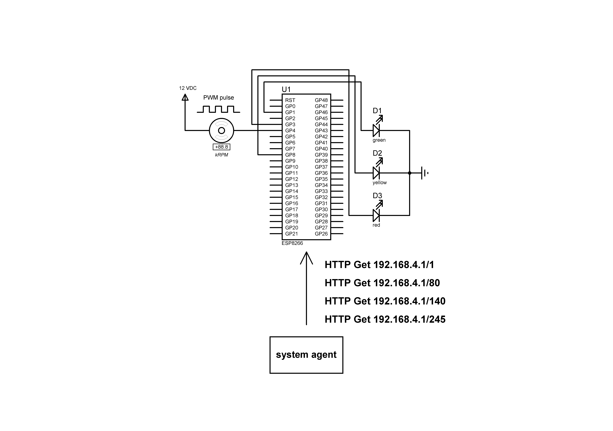

# PWM_coolpad

## Procedure
1. Get cpu temperature from LibreHardwareMonitor
2. If cpu temperature more than 50c pwm signal is set to 5
3. If cpu temperature more than 60c pwm signal is set to 140
4. If cpu temperature more than 70c pwm signal is set to 245
5. Print cpu temperature

## Resource
https://github.com/LibreHardwareMonitor/LibreHardwareMonitor

https://randomnerdtutorials.com/esp8266-pwm-arduino-ide/

https://github.com/stefanthoss/esp8266-fan-control
